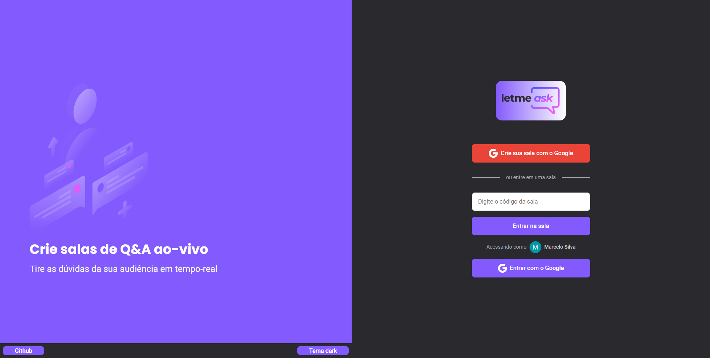
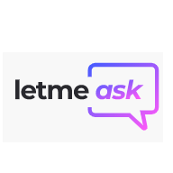

<h1 align="center">
  
</h1>

 

  

## ✨ Tecnologias

Esse projeto foi desenvolvido com as seguintes tecnologias:

- [React](https://reactjs.org)
- [TypeScript](https://www.typescriptlang.org/)
- [Firebase](https://console.firebase.google.com/)

## 💻 Projeto

O letmeask é um app para tirar as dúvidas da sua audiência em tempo-real.

## 🚀 Demonstração (Live app)
[Site demo](https://letmeask-dd3c2.firebaseapp.com/)

## 🚀 Como executar

- Clone o repositório
- Instale as dependências com `npm install`
- Informe suas credenciais do firebase no arquivo `env.local`
- Inicie o servidor com `npm run start`

Agora você pode acessar [`localhost:3000`](http://localhost:3000) do seu navegador.
